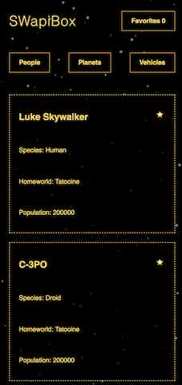

# SWapiBox
## About this project
This project was created with `create-react-app`, Start Wars API, and was exercise in learning to test asynchronous JavaScript.

[Demo](https://swapibox-react.surge.sh)
[Reop](https://github.com/andrew-t-james/swapi-box)

## Installation and Setup Instructions

Clone down this repository. You will need `node` and `npm`.

Installation:

`$ npm install`

To Run Test Suite:

`$ npm test`

To Start Server:

`$ npm start`

To Visit App:

`localhost:3000`

## Application

**Desktop**

**Mobile**
